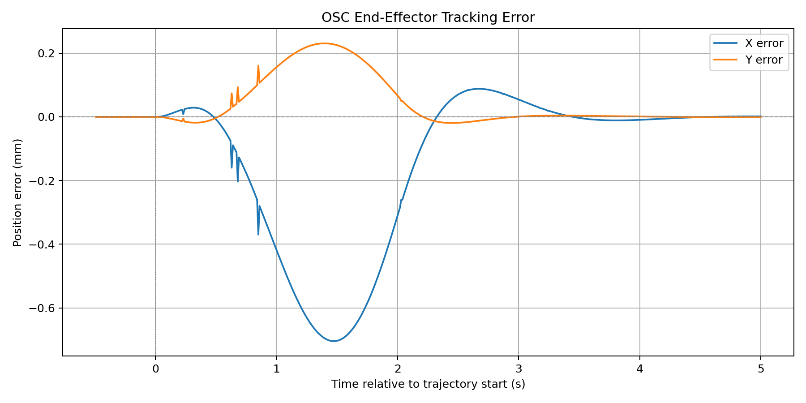
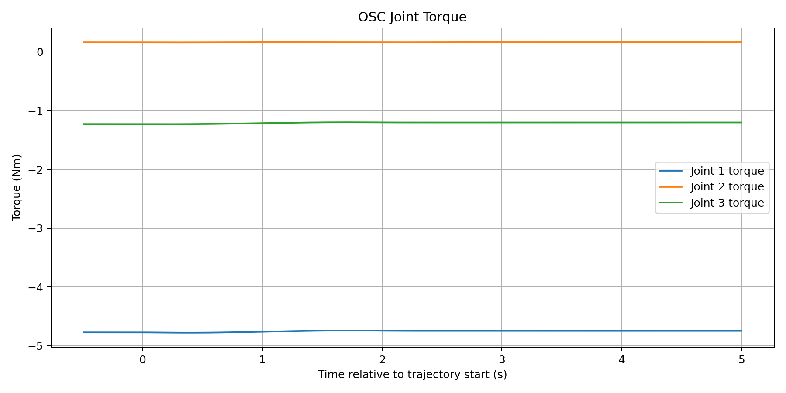
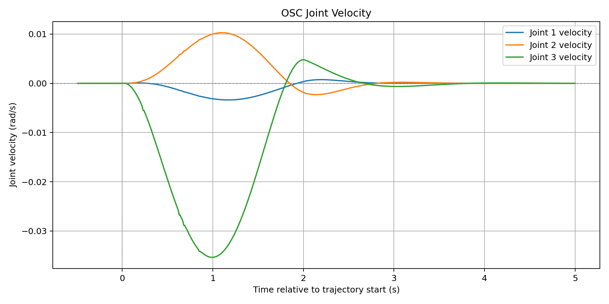

# OSC 实验记录

本目录保存两组 ROS 2 Jazzy / MCAP 录包和基线曲线。返回[首页](../README.md)；读取与绘图方式见[脚本说明](../scripts/README.md)。

## 录包索引

时长和消息数量来自各自的 `metadata.yaml`：

| 录包 | 时长 | 总消息数 | `/joint_states` | `/osc_tracking` | `/effort_controller/commands` |
| --- | --- | --- | --- | --- | --- |
| [`baseline_01`](baseline_01/metadata.yaml) | 40.22 s | 11,639 | 4,023 | 3,808 | 3,808 |
| [`saturation_01`](saturation_01/metadata.yaml) | 51.24 s | 15,333 | 5,084 | 5,124 | 5,125 |

每组目录都包含 `metadata.yaml` 和一个同名前缀的 `_0.mcap` 文件。`/joint_states` 为 `sensor_msgs/msg/JointState`，另两个话题为 `std_msgs/msg/Float64MultiArray`。跟踪消息的[16 字段格式](../src/three_link_arm_kinematics/README.md#osc-接口)与关节空间 CSV 的 13 字段格式不同。

这些目录名用于区分记录，不是完整的工况说明。附带元数据没有保存控制增益、力矩上限或参数快照；不能仅凭 `saturation_01` 的名称推断当时具体的限幅值，也不能将当前 `osc_params.yaml` 当作录制参数证明。录包时长包含等待等阶段，不等于轨迹移动时长。

只读遍历当前文件时，`baseline_01` 中有 2,982 条跟踪消息满足轨迹时间 `t > 0`，而 `saturation_01` 中没有这样的记录。因此后者不能直接作为已启动轨迹的跟踪结果；当前绘图脚本若改读该录包，会因未检测到轨迹开始而报错。这一观察本身不能确定当时未启动轨迹的原因。

## 只读检查

在工作空间根目录加载 ROS 环境后查看，无需启动 Gazebo，也不会向控制话题发布消息：

```bash
source /opt/ros/jazzy/setup.bash
ros2 bag info osc_records/baseline_01
ros2 bag info osc_records/saturation_01
```

如果后续需要回放，应先隔离正在运行的控制系统；这两组数据包含力矩命令话题，直接回放会发布记录中的消息。读取统计和查看下方图片不需要回放。

## 已保存的基线曲线

以下为仓库已有图片。绘图脚本固定选择 `baseline_01`，取第一条轨迹时间大于零的跟踪消息作为横轴起点，显示其前 `0.5 s` 到后 `5 s`；完整录包时长见上表。重新运行脚本会覆盖这些图片。

### 末端位置误差



### 关节力矩指令



当前控制节点的跟踪力矩字段记录限幅后的发布命令，不是原始需求或测量力矩；历史记录的具体软件版本仍需结合当时的实验信息确认。

### 关节速度



## 历史记录与结果边界

根目录另有 [`osc_ros2_run1/`](../osc_ros2_run1/)，其命令话题是 `/joint_effort_command`，与本目录录包不同。旧根目录 CSV 已从当前版本移除，可从 Git 历史中查看；需要新的 CSV 时由关节空间记录器重新生成。

保留录包和曲线有助于复核实验，但不能仅凭文件存在认定某组参数、保护动作或 Gazebo 闭环已通过验收；当前文档没有为未记录的工况补作推断。
